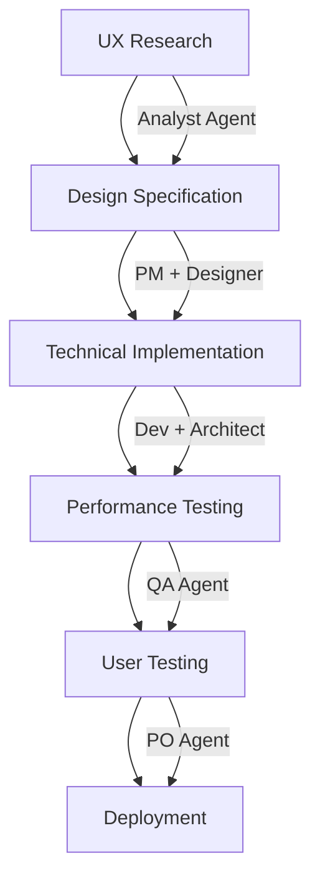
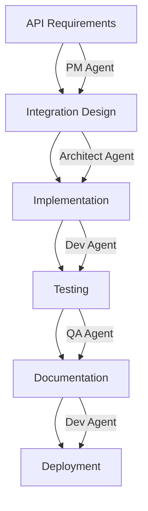

# BMAD Development Workflow voor Beeylo

## Document Information
- **Version**: 1.0
- **Date**: December 2024
- **Author**: BMAD Implementation Team
- **Status**: Implementation Guide

## Workflow Overview

Dit document beschrijft hoe we BMAD (Agentic Agile Driven Development) implementeren in het lopende Beeylo project. We gebruiken een hybride aanpak die de bestaande development flow respecteert terwijl we BMAD principes introduceren.

## BMAD Agent Rollen & Verantwoordelijkheden

### Core Development Agents

#### 1. Analyst Agent 🔍
**Verantwoordelijkheden**:
- User behavior analysis
- Market research en competitive analysis
- Data interpretation en insights
- User feedback analysis

**Tools & Templates**:
- User research templates
- Analytics dashboards
- Competitive analysis frameworks
- User journey mapping

#### 2. Product Manager (PM) Agent 📋
**Verantwoordelijkheden**:
- Feature prioritization
- Roadmap planning
- Stakeholder communication
- Requirements gathering

**Tools & Templates**:
- PRD templates
- Feature specification templates
- Roadmap planning tools
- Stakeholder communication templates

#### 3. Architect Agent 🏗️
**Verantwoordelijkheden**:
- Technical architecture decisions
- System design en scalability
- Technology stack evaluation
- Performance optimization

**Tools & Templates**:
- Architecture decision records (ADRs)
- System design templates
- Performance benchmarking tools
- Technology evaluation frameworks

#### 4. Product Owner (PO) Agent 🎯
**Verantwoordelijkheden**:
- User story creation
- Acceptance criteria definition
- Sprint planning
- Backlog management

**Tools & Templates**:
- User story templates
- Acceptance criteria checklists
- Sprint planning templates
- Backlog prioritization frameworks

#### 5. Scrum Master (SM) Agent 🚀
**Verantwoordelijkheden**:
- Process optimization
- Team coordination
- Impediment removal
- Continuous improvement

**Tools & Templates**:
- Sprint retrospective templates
- Process improvement frameworks
- Team coordination tools
- Impediment tracking systems

#### 6. Developer (Dev) Agent 💻
**Verantwoordelijkheden**:
- Code implementation
- Technical documentation
- Code review
- Testing implementation

**Tools & Templates**:
- Code review checklists
- Technical documentation templates
- Testing frameworks
- Implementation guidelines

#### 7. Quality Assurance (QA) Agent 🧪
**Verantwoordelijkheden**:
- Test planning en execution
- Quality metrics tracking
- Bug reporting en tracking
- User acceptance testing

**Tools & Templates**:
- Test plan templates
- Bug report templates
- Quality metrics dashboards
- UAT checklists

## BMAD Workflow Implementation

### Phase 1: Planning (Web UI - Ideaal)
*Voor nieuwe features en major updates*

#### 1.1 Feature Ideation
**Agents**: Analyst + PM
**Process**:
1. Market research en user feedback analysis
2. Feature opportunity identification
3. Initial business case development
4. Stakeholder alignment

**Deliverables**:
- Feature opportunity document
- Initial business case
- Stakeholder feedback summary

#### 1.2 Requirements Definition
**Agents**: PM + PO + Analyst
**Process**:
1. Detailed requirements gathering
2. User story creation
3. Acceptance criteria definition
4. Technical feasibility assessment

**Deliverables**:
- Detailed feature specification
- User stories with acceptance criteria
- Technical feasibility report

#### 1.3 Technical Planning
**Agents**: Architect + Dev
**Process**:
1. Technical architecture review
2. Implementation approach definition
3. Resource estimation
4. Risk assessment

**Deliverables**:
- Technical implementation plan
- Architecture decision records
- Resource estimates
- Risk mitigation strategies

### Phase 2: Core Development (IDE)
*Hands-on development en implementation*

#### 2.1 Sprint Planning
**Agents**: SM + PO + Dev + QA
**Process**:
1. Sprint goal definition
2. Story point estimation
3. Task breakdown
4. Capacity planning

**Deliverables**:
- Sprint backlog
- Task assignments
- Definition of Done
- Sprint goals

#### 2.2 Development Cycle
**Agents**: Dev + Architect + QA
**Process**:
1. Feature implementation
2. Code review
3. Testing implementation
4. Documentation updates

**Deliverables**:
- Working software increment
- Updated documentation
- Test coverage reports
- Code review feedback

#### 2.3 Quality Assurance
**Agents**: QA + Dev + PO
**Process**:
1. Feature testing
2. User acceptance testing
3. Performance testing
4. Bug fixing

**Deliverables**:
- Test execution reports
- Bug reports en fixes
- Performance metrics
- UAT sign-off

### Phase 3: Review & Retrospective
**Agents**: SM + All team members
**Process**:
1. Sprint review
2. Retrospective meeting
3. Process improvements
4. Next sprint planning

**Deliverables**:
- Sprint review notes
- Retrospective action items
- Process improvement plans
- Next sprint preparation

## Beeylo-Specific Workflow Adaptations

### Current Project Integration

#### 1. Immediate Implementation (Week 1-2)
**Focus**: Documentation en process setup

**Actions**:
- [ ] Setup BMAD documentation structure
- [ ] Create initial PRD en architecture docs
- [ ] Establish agent roles en responsibilities
- [ ] Implement basic workflow templates

**Agents**: PM + Architect + SM

#### 2. Feature Development Integration (Week 3+)
**Focus**: Apply BMAD to new features

**Process**:
1. **Feature Request** → Analyst Agent analyzes need
2. **Requirements** → PM Agent creates specification
3. **Technical Design** → Architect Agent designs solution
4. **Implementation** → Dev Agent implements with QA oversight
5. **Review** → SM Agent facilitates review en retrospective

### Specific Beeylo Workflows

#### Premium UX Enhancement Workflow


#### API Integration Workflow


## Templates & Checklists

### Feature Development Template

#### 1. Feature Specification Template
```markdown
# Feature: [Feature Name]

## Overview
- **Description**: Brief feature description
- **Business Value**: Why this feature matters
- **User Impact**: How users benefit

## Requirements
- **Functional Requirements**: What the feature does
- **Non-Functional Requirements**: Performance, security, etc.
- **Acceptance Criteria**: Definition of done

## Technical Approach
- **Architecture**: How it fits in current system
- **Implementation**: Technical approach
- **Testing**: Testing strategy

## Success Metrics
- **KPIs**: Key performance indicators
- **Measurement**: How success is measured
```

#### 2. Code Review Checklist
```markdown
## Code Review Checklist

### Functionality
- [ ] Code meets requirements
- [ ] Edge cases handled
- [ ] Error handling implemented

### Quality
- [ ] Code follows style guidelines
- [ ] Proper TypeScript typing
- [ ] Performance considerations

### Testing
- [ ] Unit tests included
- [ ] Integration tests updated
- [ ] Manual testing completed

### Documentation
- [ ] Code comments added
- [ ] Documentation updated
- [ ] API documentation current
```

#### 3. Sprint Retrospective Template
```markdown
## Sprint Retrospective

### What Went Well
- Successes en positive outcomes
- Process improvements that worked
- Team collaboration highlights

### What Could Be Improved
- Challenges en obstacles
- Process inefficiencies
- Areas for improvement

### Action Items
- Specific improvements to implement
- Process changes to try
- Tools or resources needed

### Next Sprint Focus
- Key priorities
- Process experiments
- Success metrics
```

## Tool Integration

### Development Tools
- **IDE**: VS Code with BMAD extensions
- **Version Control**: Git with feature branch workflow
- **Project Management**: GitHub Projects or similar
- **Documentation**: Markdown files in `/docs` folder

### BMAD-Specific Tools
- **Agent Templates**: Standardized document templates
- **Workflow Automation**: GitHub Actions for process automation
- **Quality Gates**: Automated checks for code quality
- **Metrics Dashboard**: Track development metrics

## Quality Gates & Definition of Done

### Feature Development DoD
- [ ] Requirements documented en approved
- [ ] Technical design reviewed
- [ ] Code implemented en reviewed
- [ ] Tests written en passing
- [ ] Documentation updated
- [ ] Performance benchmarks met
- [ ] Security review completed
- [ ] User acceptance testing passed

### Release DoD
- [ ] All features meet individual DoD
- [ ] Integration testing completed
- [ ] Performance testing passed
- [ ] Security audit completed
- [ ] Documentation complete en current
- [ ] Deployment plan approved
- [ ] Rollback plan prepared

## Metrics & Monitoring

### Development Metrics
- **Velocity**: Story points completed per sprint
- **Quality**: Bug rate en code coverage
- **Efficiency**: Cycle time en lead time
- **Satisfaction**: Team en stakeholder satisfaction

### Product Metrics
- **User Engagement**: Daily/monthly active users
- **Conversion**: Waitlist to active user conversion
- **Performance**: Page load times en error rates
- **Business**: Revenue en growth metrics

## Continuous Improvement

### Regular Reviews
- **Weekly**: Sprint reviews en planning
- **Monthly**: Process retrospectives
- **Quarterly**: Workflow optimization reviews
- **Annually**: BMAD methodology assessment

### Process Evolution
- Adapt workflows based on team feedback
- Integrate new BMAD features en improvements
- Scale processes as team grows
- Maintain documentation currency

---

**Implementation Note**: Start with basic BMAD principles en gradually introduce more sophisticated workflows as the team becomes comfortable with the methodology. Focus on value delivery while building process maturity.